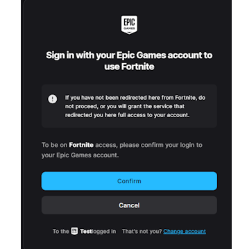
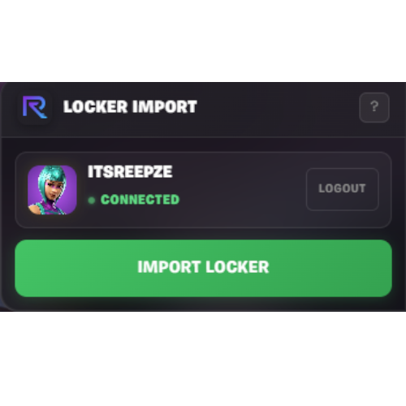

# Fortnite.gg Locker Importer

Import your entire Fortnite locker to [fortnite.gg](https://fortnite.gg) with one click.

## Features

- **One-click import** - Connect your Epic account and import all your cosmetics
- **Auto-sorting** - Items get sorted by type (outfits first, then backblings, pickaxes...) and rarity
- **Secure login** - Uses Epic's official Device Code flow, your password never touches the script
- **Session saving** - Stay logged in for ~2 hours, no need to re-authenticate every time

## Installation

1. Install [Tampermonkey](https://www.tampermonkey.net/) for your browser
2. Install the script from [Greasyfork](https://greasyfork.org/en/scripts/563780)

## How to Use

1. Go to [fortnite.gg/locker](https://fortnite.gg/locker)
2. Click **"Link Epic Account"** in the panel
3. Login to Epic Games and click **"Confirm"**
4. Click **"Import Locker"** and wait for it to finish
5. Done! You'll be redirected to your locker page

## Screenshots

### Panel

### Login

### Confirm

### Connected

### Importing

## FAQ

**Is this safe?**
Yes. The script uses Epic's official OAuth flow. Your password is never entered in the script, you login directly on Epic's website. The script only receives a temporary token that can read your locker, nothing else.

**Why do I need to login again after a while?**
The token expires after ~2 hours for security reasons. This is normal.

**Some items are missing?**
The script can only show items that exist in fortnite.gg's database. Very new items might not be added yet.

## Support

If you like this script, you can support me by using creator code **"Reepze"** in the Fortnite item shop!

## License

All Rights Reserved - you can use it, but don't redistribute or modify without permission.

---

Made with ❤️ by [Reepze](https://fortnite.gg/@reepze)
