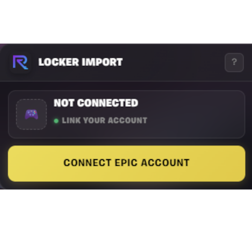
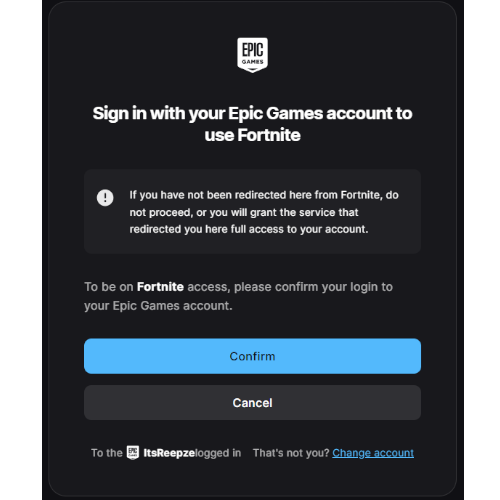

# Fortnite.gg Locker Importer

Automatically import your entire Fortnite locker to Fortnite.gg in seconds.

## ✨ Features

- **Fast Import** - Import 8500+ items in seconds instead of hours
- **Automatic Sync** - Fetches your locker directly from Epic Games
- **Optimized** - Smart compression keeps import URLs short and efficient
- **Secure** - Login happens on Epic's official website, no credentials stored
- **Open Source** - Full transparency, audit the code yourself

## 📸 Screenshots

<table>
  <tr>
    <td></td>
    <td></td>
  </tr>
  <tr>
    <td align="center"><em>Simple one-click import interface</em></td>
    <td align="center"><em>Secure Epic Games authentication</em></td>
  </tr>
  <tr>
    <td></td>
    <td></td>
  </tr>
  <tr>
    <td align="center"><em>Confirm Epic Games Login</em></td>
    <td align="center"><em>Import your locker in seconds</em></td>
  </tr>
</table>

## 🚀 Installation

### Easy Method (Recommended)
1. Install [Tampermonkey](https://www.tampermonkey.net/) or [Violentmonkey](https://violentmonkey.github.io/)
2. Click here: [Install from Greasyfork](https://greasyfork.org/en/scripts/563780)
3. Click "Install"

### Manual Method
1. Install a userscript manager (see above)
2. Create a new script
3. Copy the contents of `fngg-locker-importer.user.js`
4. Save

## 📖 How to Use

1. Go to [Fortnite.gg](https://fortnite.gg/locker)
2. Click the  import panel on the right side
3. Click "Connect Epic Account" and login
4. Click "Import Locker"
5. Done! ✅

## 🔒 Security

Your security is our priority:

- ✅ **Open Source** - Every line of code is visible and auditable
- ✅ **Read-Only Access** - Cannot modify your account or make purchases
- ✅ **No Data Collection** - Nothing sent to third parties
- ✅ **Official Login** - Authentication happens on Epic's website
- ✅ **Temporary Token** - Access expires after ~2 hours

### How Login Works
1. You click "Connect Epic Account"
2. Epic's official login page opens in a new tab
3. You login on Epic's website (not through the script)
4. Epic provides a temporary access token
5. Script uses token to read your locker (read-only)

**The script never sees your password.**

## 🛠️ Technical Details

- Fetches locker data from Epic's official API endpoints
- Uses differential encoding with pako deflateRaw for optimal compression
- Numeric sorting keeps URLs under 8000 characters for 8500+ items
- Respects Epic's rate limits and API guidelines

## ⚠️ Disclaimer

This project is **not affiliated with, endorsed by, or connected to**:
- Epic Games, Inc.
- Fortnite.gg

This is an unofficial, fan-made tool. Use at your own risk.

## 🐛 Troubleshooting

**"Session expired" error**
- Click "Connect Epic Account" again to login

**Items not importing**
- Make sure you're logged in to Fortnite.gg
- Try refreshing the page

**Import button not showing**
- Make sure Tampermonkey/Violentmonkey is enabled
- Check if the script is active on fortnite.gg

## 💬 Support

Found a bug or have a suggestion?
- Open an [Issue](https://github.com/ItsReepze/fngg-locker-importer/issues)
- Or reach out on Reddit: u/ItsReepze

## 📜 License

All Rights Reserved. This code is provided for transparency and auditing purposes only.

---

Made with ❤️ by [ItsReepze](https://github.com/ItsReepze)
