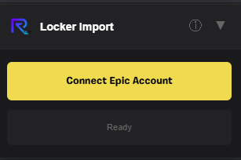
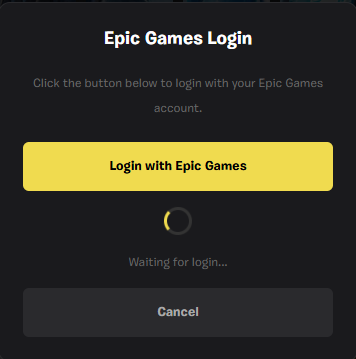
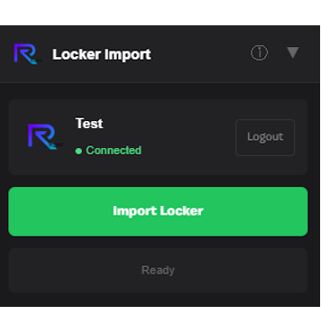

# Fortnite.gg Locker Importer

Import your entire Fortnite locker to fortnite.gg with one click. No more manually adding items.

## ⚠️ Important

This project is **not affiliated with Epic Games or fortnite.gg**. Its an unofficial fan project made by [Reepze](https://github.com/ItsReepze).

**Only download this script from official sources:**
- GitHub: https://github.com/ItsReepze/fngg-locker-importer
- Greasyfork: https://greasyfork.org/en/scripts/563780

If you got this from anywhere else, dont use it. Could be a fake trying to steal your account.

## What it does

Connect your Epic account, click import, done. The script reads all your cosmetics and creates a fortnite.gg locker link. Everything gets sorted by type and rarity automatically.

## Features

- One click import
- Auto sorting (skins first, then backblings, pickaxes, etc)
- Secure Epic login (your password never touches the script)
- Modern glassmorphism UI design
- Uses fortnite.gg's native font
- Shows your equipped skin from your profile
- Stays logged in for about 2 hours

## Is this safe?

Yes. Heres why:

- **Open source** so you can check the code yourself
- **No password entry** in the script, you login on Epics official website
- **Read only access**, cant modify your account or buy anything
- **No data collection**, nothing gets sent anywhere except Epic and fortnite.gg
- **Token expires** after roughly 2 hours

## Installation

1. Install [Tampermonkey](https://www.tampermonkey.net/) for your browser
2. Install the script from [Greasyfork](https://greasyfork.org/en/scripts/563780)

## How to use

1. Go to fortnite.gg/locker
2. Click "Connect Epic Account"
3. Login on Epic's website
4. Click "Import Locker"
5. Done!

## Screenshots

## FAQ

**Can I get banned?**
This only reads your locker data, same as looking at your locker ingame. Doesnt modify anything or give gameplay advantages. But Epic doesnt officially support third party tools so use at your own risk.

**Why do I need to login again?**
Token expires after about 2 hours. Thats normal and for security.

**Some items missing?**
The script can only show items that fortnite.gg has in their database. Brand new items might not be there yet.

## Known Issues

- Very new items might be missing if fortnite.gg hasnt added them to their database yet
- Doesnt work when fortnite.gg is in maintenance mode

## Support

If you like this, use code **Reepze** in the item shop!

## Changelog

### v2.6
- Slimmer UI with reduced padding
- Info panel dynamically positions (never overlaps main panel)
- Fixed clipping issues on scaled screens

## License

All Rights Reserved. You can use it but dont redistribute or modify without permission.

Made by [Reepze](https://github.com/ItsReepze)
